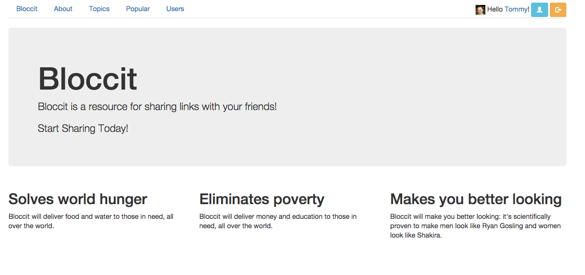

## Bloccit: a Reddit clone to teach the fundamentals of web development and Rails 4.

###Gems and Services Used

#####Faker
Used to seed data for the application to see how things would look and feel.
#####Devise
Used as a user authentication solution.
#####Figaro
Used to store ENV variables safely in a single YAML file.
#####Pundit
Used to build a simple scaleable authorization system.
#####Carrierwave
Used to upload files such as images in our application.
#####MiniMagick
Used as our image library to help process images.
#####RSpec
Used to test our application to make sure things were doing what they were suppose to.  Helps debug the application
and guide you while adding features.
#####Amazon S3
Used Amazon S3 with Fog gem to store images to the cloud.

These are a few of the gems and services that I was able to work with while creating this Ruby on Rails Application.

Made with my mentor Timothy Barnes at [Bloc](http://bloc.io).